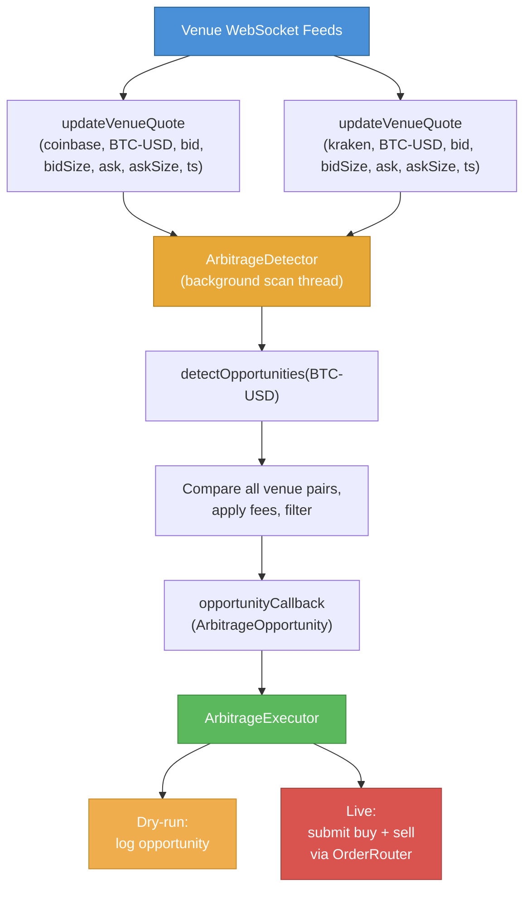

# Cross-Exchange Arbitrage

## Overview

PinnacleMM includes a cross-exchange arbitrage system that detects and optionally executes price discrepancies across multiple venues. The system consists of two components:

- **ArbitrageDetector**: Continuously scans venue quotes for profitable spreads
- **ArbitrageExecutor**: Submits simultaneous buy/sell orders to capture the spread

## Quick Start

```bash
# Enable arbitrage detection in dry-run mode (logs opportunities, no execution)
cd build && ./pinnaclemm --mode simulation --symbols BTC-USD --enable-arbitrage --arb-dry-run

# Customize minimum spread threshold
cd build && ./pinnaclemm --mode simulation --enable-arbitrage --arb-min-spread 10.0 --arb-dry-run
```

## CLI Flags

| Flag | Description | Default |
|------|-------------|---------|
| `--enable-arbitrage` | Enable the arbitrage detector | `false` |
| `--arb-min-spread` | Minimum spread in basis points | `5.0` |
| `--arb-dry-run` | Log opportunities without executing | `true` |

## Configuration

### `config/default_config.json`

```json
{
  "arbitrage": {
    "enabled": false,
    "minSpreadBps": 5.0,
    "minProfitUsd": 1.0,
    "maxStalenessMs": 500,
    "scanIntervalMs": 10,
    "dryRun": true,
    "venues": ["coinbase", "kraken"],
    "venueFees": {
      "coinbase": 0.001,
      "kraken": 0.0016
    }
  }
}
```

### Configuration Fields

| Field | Type | Description |
|-------|------|-------------|
| `enabled` | bool | Master switch for arbitrage |
| `minSpreadBps` | double | Minimum net spread (after fees) in bps to consider |
| `minProfitUsd` | double | Minimum estimated profit in USD |
| `maxStalenessMs` | uint64 | Maximum quote age before it's considered stale |
| `scanIntervalMs` | uint64 | How often the detector scans for opportunities |
| `dryRun` | bool | If true, log opportunities without executing |
| `venues` | string[] | List of venue identifiers |
| `venueFees` | map | Per-venue trading fee as a fraction (e.g., 0.001 = 0.1%) |

## Architecture

### Opportunity Detection

The `ArbitrageDetector` maintains a per-venue, per-symbol quote cache. On each scan cycle:

1. For each symbol, enumerate all venue pairs
2. For each pair, check if `venue_A.bid - venue_B.ask > fees`
3. Apply staleness filtering (reject quotes older than `maxStalenessMs`)
4. Apply fee adjustment: `net_spread = (bid - ask) - (ask * fee_buy) - (bid * fee_sell)`
5. Convert to basis points: `spreadBps = (net_spread / midPrice) * 10000` where `midPrice = (ask + bid) / 2`
6. Filter by `minSpreadBps` and `minProfitUsd`

### Data Flow



### ArbitrageOpportunity

```cpp
struct ArbitrageOpportunity {
    std::string symbol;
    std::string buyVenue;      // Venue with lowest ask
    std::string sellVenue;     // Venue with highest bid
    double buyPrice;           // Best ask at buy venue
    double sellPrice;          // Best bid at sell venue
    double spread;             // Net spread after fees (sellPrice - buyPrice - fees)
    double spreadBps;          // Net spread in basis points: (spread / midPrice) * 10000
    double maxQuantity;        // Min of buy/sell available size
    double estimatedProfit;    // spread * maxQuantity
    uint64_t detectedAt;       // Nanosecond timestamp
};
```

### ArbitrageExecutor

The executor supports two modes:

- **Dry-run** (`dryRun: true`): Simulates execution, returns synthetic fill results
- **Live** (`dryRun: false`): Uses an `OrderSubmitCallback` to route orders through `OrderRouter`

### Risk Controls

- **Staleness filter**: Quotes older than `maxStalenessMs` are rejected
- **Fee adjustment**: All opportunities are evaluated net of trading fees
- **Minimum thresholds**: Both `minSpreadBps` and `minProfitUsd` must be met
- **Dry-run default**: Production deployments should start in dry-run mode

## Testing

```bash
cd build
./arbitrage_detector_tests    # 8 tests
```

Test cases cover:
- Opportunity detection with sufficient spread
- Fee adjustment eliminating thin spreads
- Staleness filtering of old quotes
- Minimum spread threshold enforcement
- Dry-run execution simulation
- Opportunity callback invocation
- Statistics reporting
- Single-venue (no self-arbitrage)
