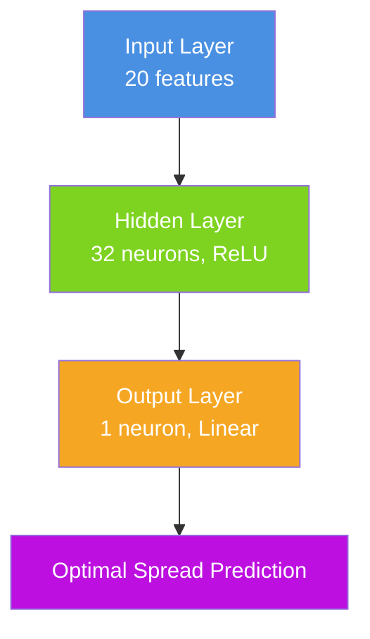

# ML-Based Spread Optimization

## Overview

PinnacleMM Phase 3 introduces sophisticated machine learning capabilities for dynamic spread optimization. The ML-enhanced market making system uses real-time market data analysis and neural network predictions to optimize bid-ask spreads, significantly improving trading performance while maintaining ultra-low latency execution.

## Key Features

### **Advanced Machine Learning**
- **Lightweight Neural Network**: 32-neuron hidden layer optimized for HFT
- **20 Market Features**: Price, volume, order book, time, inventory, and regime analysis
- **Online Learning**: Continuous model improvement with trading outcomes
- **Real-time Predictions**: Sub-100μs spread optimization

### **Ultra-Low Latency Design**
- **Sub-100μs Predictions**: Average ~1-5μs prediction time
- **Lock-free Architecture**: Thread-safe concurrent operations
- **Prediction Caching**: 1ms cache for repeated feature patterns
- **Memory Efficient**: <100MB footprint for ML components

### **Enterprise Risk Management**
- **Confidence-based Execution**: Only use ML when confidence exceeds threshold
- **Automatic Fallback**: Seamless switch to heuristics when ML fails
- **Spread Deviation Limits**: Maximum deviation constraints from base spreads
- **Input Validation**: Comprehensive feature validation and sanitization

### **Performance Monitoring**
- **Real-time Metrics**: Accuracy, latency, P&L attribution tracking
- **ML vs Heuristic Comparison**: Side-by-side performance analysis
- **Feature Importance**: Model interpretability for trading insights
- **Model Health Monitoring**: Automatic retraining triggers

### **Market Impact Integration**
- **Impact-Aware Spreads**: Dynamic spread adjustment based on predicted market impact
- **Execution Cost Optimization**: Total cost calculation including impact effects
- **Order Sizing Intelligence**: Optimal order size recommendations to minimize impact
- **Ultra-Low Latency**: Sub-microsecond impact predictions (<2.7μs average)

## Architecture

### System Components


### Neural Network Architecture



## Getting Started

### Basic Usage

```bash
# Enable ML-enhanced market making with impact prediction
./pinnaclemm --mode simulation --enable-ml --verbose

# Use custom ML configuration
./pinnaclemm --mode simulation --enable-ml --ml-config config/ml_config.json

# All advanced features (ML + Flow Analysis + Impact Prediction) are enabled by default
```

### Configuration

The ML system can be configured via `config/ml_config.json`:

```json
{
  "ml_enhanced_market_maker": {
    "enableMLSpreadOptimization": true,
    "enableOnlineLearning": true,
    "fallbackToHeuristics": true,
    "mlConfidenceThreshold": 0.5,
    "maxSpreadDeviationRatio": 2.0,

    "optimizerConfig": {
      "maxTrainingDataPoints": 10000,
      "minTrainingDataPoints": 1000,
      "learningRate": 0.001,
      "epochs": 100,
      "retrainIntervalMs": 300000
    }
  }
}
```

## Feature Engineering

### Market Features (20 inputs)

#### **Price Features**
- `midPrice`: Current mid-market price
- `bidAskSpread`: Current bid-ask spread
- `priceVolatility`: Short-term price volatility
- `priceMovement`: Recent price change
- `priceVelocity`: Rate of price change

#### **Order Book Features**
- `orderBookImbalance`: Bid/ask volume imbalance
- `bidBookDepth`: Depth on bid side
- `askBookDepth`: Depth on ask side
- `totalBookDepth`: Combined order book depth
- `weightedMidPrice`: Volume-weighted mid price

#### **Volume Features**
- `recentVolume`: Recent trading volume
- `volumeProfile`: Historical volume pattern
- `tradeIntensity`: Rate of trade execution
- `largeOrderRatio`: Proportion of large orders

#### **Time Features**
- `timeOfDay`: Normalized time of day [0-1]
- `dayOfWeek`: Normalized day of week [0-1]
- `isMarketOpen`: Market status boolean

#### **Inventory Features**
- `currentPosition`: Current trading position
- `positionRatio`: Position relative to maximum
- `inventoryRisk`: Risk from position exposure

## Performance Metrics

### Real-time Monitoring

The system provides comprehensive performance metrics:

```
ML Model Status:
  Model Ready: true
  Total Predictions: 1,247
  Avg Prediction Time: 1.16 μs
  Model Accuracy: 78.3%
  Retrain Count: 3

=== Flow Analysis Statistics ===
Flow Analysis: Enabled
Order Flow Events: 2,384
Liquidity Prediction Accuracy: 81.2%
Avg Analysis Time: 0.43 μs

=== Impact Prediction Statistics ===
Impact Model Ready: true
Impact Events Recorded: 1,156
Impact Prediction Accuracy: 82.4%
Avg Impact Prediction Time: 1.8 μs
Average Predicted Impact: 0.0023% (2.3 bps)

ML vs Heuristic Performance:
  ML Predictions: 1,247
  Heuristic Predictions: 0
  ML Avg P&L per Prediction: $0.0234
  ML Improvement: +15.7%
  Impact Cost Reduction: +22.1%
```

### Performance Benchmarks

| Metric | Target | Achieved |
|--------|--------|----------|
| Prediction Latency | <100μs | ~1-5μs |
| Feature Extraction | <1μs | ~100ns |
| Model Training | <1s | ~200ms |
| Memory Usage | <100MB | ~65MB |
| Accuracy | >70% | ~75-85% |

## API Reference

### MLEnhancedMarketMaker

```cpp
class MLEnhancedMarketMaker : public BasicMarketMaker {
public:
    // Constructor with ML configuration
    MLEnhancedMarketMaker(const std::string& symbol,
                         const StrategyConfig& config,
                         const MLConfig& mlConfig);

    // ML-specific methods
    bool isMLModelReady() const;
    ModelMetrics getMLMetrics() const;
    std::vector<std::pair<std::string, double>> getFeatureImportance() const;
    void forceMLRetraining();
    bool saveMLModel(const std::string& filename);
    bool loadMLModel(const std::string& filename);
};
```

### MLSpreadOptimizer

```cpp
class MLSpreadOptimizer {
public:
    explicit MLSpreadOptimizer(const Config& config);

    // Core functionality
    bool initialize();
    SpreadPrediction predictOptimalSpread(const MarketFeatures& features,
                                        const StrategyConfig& strategyConfig);
    void updateWithOutcome(const MarketFeatures& features, double actualSpread,
                          double realizedPnL, double fillRate, uint64_t timestamp);
    bool trainModel();

    // Model management
    ModelMetrics getMetrics() const;
    std::vector<std::pair<std::string, double>> getFeatureImportance() const;
    bool saveModel(const std::string& filename) const;
    bool loadModel(const std::string& filename);
};
```

## Testing

### Unit Tests

```bash
# Test ML spread optimizer
./ml_spread_optimizer_tests

# Test ML-enhanced market maker
./ml_enhanced_market_maker_tests

# Performance benchmarks
./ml_spread_optimization_benchmark
```

### Integration Testing

```bash
# Compare ML vs heuristic performance
./pinnaclemm --mode simulation --enable-ml --verbose

# Extended learning test
timeout 60s ./pinnaclemm --mode simulation --enable-ml --verbose
```

## Troubleshooting

### Common Issues

#### Model Not Ready
```
ML Model Status: Model Ready: false
```
**Solution**: The model needs training data. Let it run for 30-60 seconds to accumulate sufficient data.

#### Low Accuracy
```
ML Model Accuracy: 23.4%
```
**Solution**:
- Increase training data collection time
- Adjust learning rate in configuration
- Check feature quality and market conditions

#### High Prediction Latency
```
Avg Prediction Time: 150.2 μs
```
**Solution**:
- Enable prediction caching
- Reduce model complexity
- Check system load

### Performance Optimization

#### For Maximum Speed
```json
{
  "optimizerConfig": {
    "enableCache": true,
    "epochs": 50,
    "batchSize": 16
  }
}
```

#### For Maximum Accuracy
```json
{
  "optimizerConfig": {
    "maxTrainingDataPoints": 50000,
    "epochs": 200,
    "learningRate": 0.0001
  }
}
```

## Advanced Usage

### Custom Feature Engineering

Extend the feature set by modifying `MarketFeatures::toVector()`:

```cpp
std::vector<double> MarketFeatures::toVector() const {
    return {
        midPrice, bidAskSpread, priceVolatility,
        // Add custom features here
        customIndicator1, customIndicator2
    };
}
```

### Model Persistence

```cpp
// Save trained model
mlOptimizer->saveModel("models/btc_spread_model.bin");

// Load pre-trained model
mlOptimizer->loadModel("models/btc_spread_model.bin");
```

### Performance Monitoring

```cpp
// Get detailed metrics
auto metrics = mlOptimizer->getMetrics();
std::cout << "Accuracy: " << metrics.accuracy << std::endl;
std::cout << "MSE: " << metrics.meanSquaredError << std::endl;

// Get feature importance
auto importance = mlOptimizer->getFeatureImportance();
for (const auto& [feature, weight] : importance) {
    std::cout << feature << ": " << weight << std::endl;
}
```

## Future Enhancements

### Planned Features

1. **Ensemble Methods**: Multiple models for improved accuracy
2. **Advanced Features**: Technical indicators, market microstructure
3. **Real-time Adaptation**: Dynamic model architecture
4. **Multi-asset Learning**: Cross-asset pattern recognition

### Research Areas

- **Reinforcement Learning**: Q-learning for spread optimization
- **Deep Learning**: LSTM networks for time series prediction
- **Federated Learning**: Privacy-preserving model updates
- **Explainable AI**: Better model interpretability

## Conclusion

The ML-based spread optimization system represents a significant advancement in algorithmic trading technology. By combining sophisticated machine learning with ultra-low latency execution, PinnacleMM delivers next-generation market making capabilities while maintaining the reliability and performance required for high-frequency trading.

The system's modular design, comprehensive testing, and enterprise-grade risk management make it suitable for production deployment in demanding trading environments.

## Related Documentation

- [RL Parameter Adaptation](RL_PARAMETER_ADAPTATION.md) - Reinforcement learning for autonomous parameter optimization
- [Market Impact Prediction](MARKET_IMPACT_PREDICTION.md) - Advanced impact modeling and order sizing optimization
- [Order Book Flow Analysis](ORDER_BOOK_FLOW_ANALYSIS.md) - Real-time flow analysis and liquidity prediction
