# Risk Management System

## Overview

PinnacleMM's risk management module (`core/risk/`) provides comprehensive pre-trade and post-trade risk controls for production market making. The system is designed around two priorities: **correctness** (every order must pass risk checks) and **speed** (the hot-path check must not bottleneck the trading loop).

The module consists of five components:

| Component | Responsibility |
|---|---|
| **RiskManager** | Pre-trade order checks, position/exposure tracking, auto-hedging |
| **CircuitBreaker** | Market circuit breaker with automatic halt/resume |
| **VaREngine** | Real-time Value at Risk using historical, parametric, and Monte Carlo methods |
| **AlertManager** | Alerting with throttling and callback delivery |
| **DisasterRecovery** | Risk state persistence, backup management, position reconciliation |

All components are singletons accessed via `getInstance()` and initialized at startup from `config/default_config.json`.

---

## Architecture

### Hot Path Design

The pre-trade risk check (`RiskManager::checkOrder()`) is on the critical path of every order. It uses only atomic loads -- no mutexes, no allocations, no syscalls. Measured latency is ~750ns per check.

`CircuitBreaker::isTradingAllowed()` is a single `std::atomic<CircuitBreakerState>` load (~5ns) called before each quoting cycle.

### State Flow

```mermaid
flowchart TD
    MD["Market Data"] --> CB["CircuitBreaker::onPrice()<br/>CircuitBreaker::onSpread()<br/>CircuitBreaker::onVolume()<br/>CircuitBreaker::onLatency()"]
    CB --> STATE["CLOSED / OPEN / HALF_OPEN"]
    STATE --> SL["Strategy Loop"]
    SL --> BMM["BasicMarketMaker::strategyMainLoop()"]
    BMM --> CHECK{"isTradingAllowed()?"}
    CHECK -- No --> CANCEL["Cancel all, wait"]
    CHECK -- Yes --> UQ["updateQuotes()"]
    UQ --> PO["placeOrder()"]
    PO --> RM{"RiskManager::checkOrder()<br/> lock-free"}
    RM -- APPROVED --> SUBMIT["Submit to exchange"]
    RM -- REJECTED_* --> LOG["Log, skip"]
    BMM --> PE["processEvents()"]
    PE --> FILL["on fill → RiskManager::onFill()"]
    FILL --> UP["Update position, PnL"]
    FILL --> AM["AlertManager<br/>(if thresholds crossed)"]
    FILL --> VAR["VaREngine::addReturn()"]
```



---

## RiskManager

### Pre-Trade Checks

`checkOrder(side, price, quantity, symbol)` evaluates the following checks in order:

| Check | Rejection Code | What It Validates |
|---|---|---|
| Trading halt | `REJECTED_HALTED` | `isHalted()` flag |
| Rate limit | `REJECTED_RATE_LIMIT` | Orders per second vs `maxOrdersPerSecond` |
| Order size | `REJECTED_ORDER_SIZE_LIMIT` | Quantity vs `maxOrderSize`, notional vs `maxOrderValue` |
| Position limit | `REJECTED_POSITION_LIMIT` | Projected position vs `maxPositionSize` |
| Daily volume | `REJECTED_VOLUME_LIMIT` | Cumulative daily volume vs `maxDailyVolume` |
| Daily loss | `REJECTED_DAILY_LOSS_LIMIT` | `dailyPnL` vs `dailyLossLimit` |
| Drawdown | `REJECTED_DRAWDOWN_LIMIT` | Current drawdown vs `maxDrawdownPct` |
| Exposure | `REJECTED_EXPOSURE_LIMIT` | Net/gross exposure vs limits |

Returns `APPROVED` if all checks pass.

### Post-Trade Updates

`onFill(side, price, quantity, symbol)` updates position, daily volume, and exposure atomics. `onPnLUpdate(newPnL)` tracks peak PnL and drawdown, and triggers a trading halt if drawdown or daily loss limits are breached.

### Auto-Hedging

When enabled (`auto_hedge.enabled: true`), a background thread periodically calls `evaluateHedge()`. If position exceeds the hedge threshold (as a percentage of max position), it invokes the registered `HedgeCallback` with the side and quantity needed to reduce exposure.

### Trading Halt

`halt(reason)` and `resume()` provide manual halt/resume control. Halts are also triggered automatically when drawdown or daily loss limits are breached.

### Daily Reset

Daily counters (PnL, volume, order counts) are automatically reset at midnight UTC.

---

## CircuitBreaker

### State Machine


- **CLOSED**: Normal trading. `isTradingAllowed()` returns `true`.
- **OPEN**: Trading halted. All orders are cancelled. System waits for cooldown.
- **HALF_OPEN**: Test period after cooldown. Limited quoting. Re-trips if a trigger fires again.

### Triggers

| Trigger | Source | Threshold |
|---|---|---|
| `RAPID_PRICE_MOVE_1MIN` | `onPrice()` | Price move > `priceMove1minPct` in 1 minute |
| `RAPID_PRICE_MOVE_5MIN` | `onPrice()` | Price move > `priceMove5minPct` in 5 minutes |
| `SPREAD_WIDENING` | `onSpread()` | Current spread > `spreadWidenMultiplier` x baseline |
| `VOLUME_SPIKE` | `onVolume()` | Current volume > `volumeSpikeMultiplier` x baseline |
| `MARKET_CRISIS` | `onRegimeChange()` | MarketRegimeDetector reports CRISIS regime |
| `LATENCY_DEGRADATION` | `onLatency()` | Execution latency > `maxLatencyUs` |
| `CONNECTIVITY_LOSS` | `onConnectivityLoss()` | Exchange connection dropped |
| `MANUAL` | `trip(reason)` | Operator-initiated trip |

### Price History

A lock-free ring buffer (`std::array<PriceEntry, 512>` with atomic head/count) stores recent price observations. Price move calculations scan back through the buffer within the time window.

### State Callback

Register a callback via `setStateCallback()` to be notified of all state transitions. Used by `AlertManager` to raise circuit breaker alerts and by the dashboard for real-time status updates.

---

## VaREngine

### Methods

The engine calculates Value at Risk using three approaches:

| Method | Description |
|---|---|
| **Historical VaR** | Sorts observed returns and picks the percentile cutoff. No distribution assumptions. |
| **Parametric VaR** | Assumes normally distributed returns. VaR = mean + z-score * stddev. Uses Abramowitz & Stegun approximation for the inverse normal CDF. |
| **Monte Carlo VaR** | Runs 10,000 simulations (configurable) sampling from N(mean, stddev). Runs on a background thread to avoid blocking the trading loop. |

### Double-Buffered Results

The Monte Carlo thread writes results to one buffer while the trading thread reads from the other. An `std::atomic<int>` index swaps the buffers after each calculation cycle. This provides lock-free reads from `getLatestResult()`.

### Expected Shortfall

In addition to VaR, the engine calculates Expected Shortfall (CVaR) -- the average loss in the worst tail beyond the VaR threshold.

### Integration

- `RiskManager` feeds returns on each tick via `addReturn()`.
- The dashboard reads VaR results via the `/api/risk/var` REST endpoint.
- `isVaRBreached(portfolioValue)` can optionally be used as a pre-trade check.

---

## AlertManager

### Alert Types

| Type | Typical Severity | When Raised |
|---|---|---|
| `POSITION_WARNING` | WARNING | Position utilization > 80% of limit |
| `POSITION_BREACH` | CRITICAL | Position exceeds limit |
| `DRAWDOWN_WARNING` | WARNING | Drawdown > 80% of max |
| `DRAWDOWN_BREACH` | CRITICAL | Drawdown exceeds max |
| `DAILY_LOSS_WARNING` | WARNING | Daily loss > 80% of limit |
| `DAILY_LOSS_BREACH` | CRITICAL | Daily loss exceeds limit |
| `VAR_BREACH` | CRITICAL | VaR exceeds configured limit |
| `CIRCUIT_BREAKER_OPEN` | EMERGENCY | Circuit breaker trips |
| `CIRCUIT_BREAKER_HALF_OPEN` | WARNING | Entering test period |
| `CIRCUIT_BREAKER_CLOSED` | INFO | Normal trading resumed |
| `SPREAD_ANOMALY` | WARNING | Unusual spread widening |
| `VOLUME_ANOMALY` | WARNING | Unusual volume spike |
| `LATENCY_WARNING` | WARNING | High execution latency |
| `CONNECTIVITY_ISSUE` | CRITICAL | Exchange connection issues |
| `REGIME_CHANGE` | INFO | Market regime transition |
| `SYSTEM_ERROR` | CRITICAL | Internal errors |

### Throttling

To prevent alert storms during volatile markets, each alert type has a minimum interval (configured via `min_interval_ms`, default 5 seconds). Repeated alerts of the same type within the throttle window are suppressed.

### Callbacks

Register callbacks via `registerCallback()` for real-time delivery. The `VisualizationServer` uses this to push alerts to the WebSocket dashboard.

### Alert History

Alerts are stored in a bounded deque (default 1000 entries). Oldest alerts are pruned when the limit is reached. Alerts can be acknowledged via `acknowledgeAlert(id)`.

---

## REST API Endpoints

The following risk-related REST endpoints are served by the `VisualizationServer` on the API port (default 8081):

| Endpoint | Method | Description |
|---|---|---|
| `/api/risk/state` | GET | Current RiskManager state (position, PnL, drawdown, exposure, halt status) |
| `/api/risk/var` | GET | Latest VaR results (historical, parametric, Monte Carlo at 95% and 99%) |
| `/api/risk/limits` | GET | Current risk limits configuration |
| `/api/risk/circuit-breaker` | GET | Circuit breaker status (state, last trigger, trip count, cooldown) |
| `/api/risk/alerts` | GET | Recent alerts from AlertManager |
| `/api/health` | GET | Liveness probe (always 200) |
| `/api/ready` | GET | Readiness probe (200 when not halted and circuit breaker closed) |

---

## Configuration

All risk parameters are configured in the `risk_management` section of `config/default_config.json`:

```json
{
  "risk_management": {
    "limits": {
      "max_position_size": 10.0,
      "max_notional_exposure": 1000000.0,
      "max_net_exposure": 500000.0,
      "max_gross_exposure": 2000000.0,
      "max_drawdown_pct": 5.0,
      "daily_loss_limit": 10000.0,
      "max_order_size": 1.0,
      "max_order_value": 50000.0,
      "max_daily_volume": 100.0,
      "max_orders_per_second": 100
    },
    "circuit_breaker": {
      "price_move_1min_pct": 2.0,
      "price_move_5min_pct": 5.0,
      "spread_widen_multiplier": 3.0,
      "volume_spike_multiplier": 5.0,
      "cooldown_period_ms": 30000,
      "half_open_test_duration_ms": 10000,
      "max_latency_us": 10000,
      "price_history_size": 300
    },
    "var": {
      "window_size": 252,
      "simulation_count": 10000,
      "horizon": 1.0,
      "update_interval_ms": 60000,
      "var_limit_pct": 2.0
    },
    "auto_hedge": {
      "enabled": false,
      "threshold_pct": 50.0,
      "interval_ms": 5000
    },
    "alerts": {
      "min_interval_ms": 5000,
      "max_history": 1000,
      "warning_threshold_pct": 80.0,
      "critical_threshold_pct": 100.0
    }
  }
}
```

### Configuration Reference

| Parameter | Default | Description |
|---|---|---|
| `max_position_size` | 10.0 | Maximum absolute position in base asset |
| `max_notional_exposure` | 1,000,000 | Maximum notional value of position |
| `max_net_exposure` | 500,000 | Maximum net (directional) exposure |
| `max_gross_exposure` | 2,000,000 | Maximum gross (total) exposure |
| `max_drawdown_pct` | 5.0% | Maximum drawdown from peak before halt |
| `daily_loss_limit` | 10,000 | Maximum daily loss before halt |
| `max_order_size` | 1.0 | Maximum single order quantity |
| `max_order_value` | 50,000 | Maximum single order notional value |
| `max_daily_volume` | 100.0 | Maximum cumulative daily trading volume |
| `max_orders_per_second` | 100 | Rate limit for order submissions |
| `cooldown_period_ms` | 30,000 | Circuit breaker cooldown before half-open |
| `half_open_test_duration_ms` | 10,000 | Half-open test window duration |
| `var_limit_pct` | 2.0% | VaR threshold that triggers breach alert |
| `min_interval_ms` | 5,000 | Minimum interval between alerts of same type |

---

## Testing

### Unit Tests

```bash
cd build

# Risk manager (11 tests)
./risk_manager_tests

# Circuit breaker (10 tests)
./circuit_breaker_tests

# VaR engine (8 tests)
./var_engine_tests

# Alert manager (8 tests)
./alert_manager_tests

# Disaster recovery (8 tests)
./disaster_recovery_tests
```

### Performance Benchmarks

```bash
cd build
./risk_check_benchmark
```

Expected results:

| Benchmark | Latency | Notes |
|---|---|---|
| `BM_RiskCheckOrder` | ~750ns | Full pre-trade check (multiple atomic loads) |
| `BM_CircuitBreakerCheck` | ~5ns | Single atomic load |
| `BM_OnFill` | ~2.3us | Post-trade state update |
| `BM_OnPnLUpdate` | ~25ns | PnL and drawdown tracking |

---

## Source Files

| File | Lines | Purpose |
|---|---|---|
| `core/risk/RiskConfig.h` | Config structs and JSON serialization |
| `core/risk/RiskManager.h/.cpp` | Pre-trade checks, position tracking, auto-hedging |
| `core/risk/CircuitBreaker.h/.cpp` | Market circuit breaker state machine |
| `core/risk/VaREngine.h/.cpp` | Value at Risk with Monte Carlo |
| `core/risk/AlertManager.h/.cpp` | Alert system with throttling |
| `core/risk/DisasterRecovery.h/.cpp` | State persistence and backup management |
