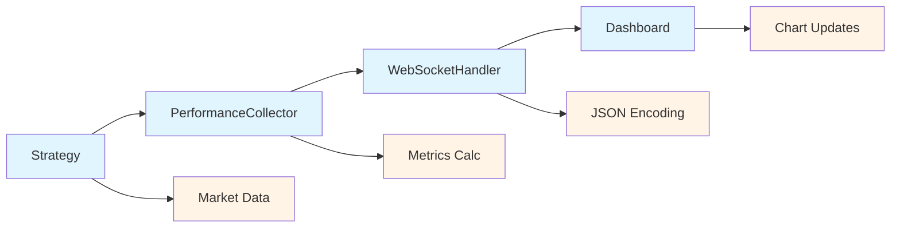

# Strategy Performance Visualization Guide

## Overview

The Strategy Performance Visualization system provides a comprehensive, real-time web-based dashboard for monitoring and analyzing trading strategy performance. Built with modern web technologies and real-time communication protocols, it offers immediate insights into strategy metrics, ML model performance, market regime analysis, and risk management statistics.

## Table of Contents

1. [Architecture Overview](#architecture-overview)
2. [Features and Capabilities](#features-and-capabilities)
3. [Getting Started](#getting-started)
4. [Dashboard Components](#dashboard-components)
5. [Real-time Data Flow](#real-time-data-flow)
6. [API Reference](#api-reference)
7. [Configuration](#configuration)
8. [Deployment](#deployment)
9. [Troubleshooting](#troubleshooting)

## Architecture Overview

The visualization system consists of three main layers:

### Backend Components
- **PerformanceCollector**: Collects real-time performance data from trading strategies
- **WebSocketHandler**: Manages real-time bidirectional communication with clients
- **RestAPIServer**: Provides HTTP endpoints for data queries and configuration
- **VisualizationServer**: Orchestrates all visualization components

### Frontend Components
- **Interactive Dashboard**: Modern web interface built with HTML5, CSS3, and JavaScript
- **Real-time Charts**: High-performance charting using Chart.js and D3.js
- **WebSocket Client**: Handles real-time data streaming and updates
- **Responsive Design**: Adaptive layout supporting desktop and mobile devices

### Communication Layer
- **WebSocket Protocol**: Real-time bidirectional communication
- **REST API**: Request-response data access
- **JSON Data Format**: Standardized data exchange format

## Features and Capabilities

### Real-time Performance Monitoring
- **Live P&L Tracking**: Real-time profit/loss updates with trend analysis
- **Position Monitoring**: Current positions and exposure tracking
- **Trade Analytics**: Win rate, trade frequency, and performance metrics
- **Risk Metrics**: Sharpe ratio, maximum drawdown, VaR calculations

### ML Model Analytics
- **Model Performance**: Accuracy, prediction latency, confidence levels
- **Training Progress**: Retraining frequency and model evolution
- **Feature Importance**: Real-time analysis of model input features
- **Prediction Monitoring**: Success rate and error analysis

### Market Regime Detection
- **Current Regime**: Real-time market condition classification
- **Regime Confidence**: Statistical confidence in regime detection
- **Transition Analysis**: Historical regime changes and durations
- **Regime Metrics**: Trend strength, volatility, mean reversion indicators

### Interactive Visualizations
- **Time Series Charts**: Configurable timeframes (1h, 4h, 1d, 1w)
- **Performance Attribution**: Drill-down analysis of returns
- **Risk Analysis**: Drawdown curves and risk-return scatter plots
- **Comparative Analysis**: Multiple strategy comparison tools

### Backtesting Integration
- **Historical Analysis**: Backtest result visualization
- **A/B Testing**: Statistical comparison of strategy variants
- **Parameter Optimization**: Performance across parameter spaces
- **Monte Carlo Results**: Risk scenario analysis and confidence intervals

## Getting Started

### Prerequisites
- **C++20 compatible compiler** (GCC 10+, Clang 12+, MSVC 2019+)
- **CMake 3.14+** for build system
- **Modern web browser** (Chrome 90+, Firefox 88+, Safari 14+)
- **Network access** for WebSocket and HTTP communication

### Building with Visualization
```bash
# Clone and build with visualization support
cd PinnacleMM
mkdir build && cd build

# Configure with visualization enabled
cmake .. -DBUILD_VISUALIZATION=ON

# Build the project
make -j$(nproc)
```

### Running with Visualization
```bash
# Start PinnacleMM with visualization enabled
./pinnaclemm --enable-ml --enable-visualization --mode simulation

# Optional: Customize ports
./pinnaclemm --enable-visualization --viz-ws-port 8080 --viz-api-port 8081
```

### Accessing the Dashboard
1. **Start PinnacleMM** with visualization enabled
2. **Open web browser** and navigate to: `file://visualization/static/index.html`
3. **Connect to server** using the connection settings (localhost:8080 by default)
4. **Select strategy** from the dropdown to begin monitoring

## Dashboard Components

### Header Section
- **Connection Status**: Real-time connection indicator
- **Server Time**: Synchronized server timestamp
- **Strategy Selector**: Dropdown for active strategy selection

### Key Metrics Overview
Six primary metric cards displaying:
- **Total P&L**: Absolute and percentage returns
- **Sharpe Ratio**: Risk-adjusted return measure
- **Max Drawdown**: Largest peak-to-trough decline
- **Win Rate**: Percentage of profitable trades
- **Total Trades**: Number of completed transactions
- **ML Accuracy**: Machine learning model performance

### Tabbed Chart Interface

#### Performance Tab
- **P&L Over Time**: Primary performance chart with configurable timeframes
- **Position Size**: Real-time position tracking
- **Sharpe Ratio**: Rolling risk-adjusted returns

#### ML Metrics Tab
- **Model Accuracy**: Prediction success rate over time
- **Prediction Latency**: Model response time monitoring
- **Model Status Grid**: Training state, prediction count, retrain frequency

#### Market Regime Tab
- **Current Regime Display**: Active market condition with confidence
- **Regime History**: Temporal regime transitions
- **Regime Metrics**: Trend strength, volatility, mean reversion bars

#### Risk Analysis Tab
- **Drawdown Curve**: Historical drawdown analysis
- **Value at Risk**: 95% and 99% VaR calculations
- **Expected Shortfall**: Tail risk measurements

#### Backtests Tab
- **Result Table**: Historical backtest performance comparison
- **Control Panel**: New backtest initiation and result refresh

## Real-time Data Flow

### Data Collection Process


### Update Frequency
- **Performance Metrics**: 1-second intervals (configurable)
- **ML Model Data**: On prediction events
- **Market Data**: Real-time order book updates
- **Risk Calculations**: 5-second intervals for complex metrics

### Data Structure Example
```json
{
  "type": "performance_update",
  "timestamp": 1672531200000000000,
  "strategies": {
    "primary_strategy": {
      "pnl": 1250.75,
      "position": 0.5,
      "sharpe_ratio": 1.42,
      "max_drawdown": 0.0325,
      "win_rate": 0.65,
      "total_trades": 147,
      "ml_accuracy": 0.73,
      "prediction_time": 1.8,
      "regime": 2,
      "regime_confidence": 0.87
    }
  }
}
```

## API Reference

### WebSocket API

#### Connection
```javascript
const ws = new WebSocket('ws://localhost:8080');
```

#### Subscribe to Updates
```json
{
  "type": "subscribe",
  "strategy_id": "primary_strategy",
  "data_type": "performance"
}
```

#### Request Historical Data
```json
{
  "type": "get_history",
  "strategy_id": "primary_strategy",
  "metric": "pnl",
  "time_range": 3600000000000
}
```

#### Get Strategy List
```json
{
  "type": "get_strategies"
}
```

### REST API Endpoints

#### Get Performance Data
```http
GET /api/v1/strategies/{strategy_id}/performance
?start_time=1672531200000000000
&end_time=1672617600000000000
```

#### Get Chart Data
```http
GET /api/v1/strategies/{strategy_id}/charts/{metric}
?timeframe=1d
&format=json
```

#### Get Backtest Results
```http
GET /api/v1/backtests
?status=completed
&limit=10
```

### Response Format
```json
{
  "success": true,
  "data": {
    "timestamp": 1672531200000000000,
    "metrics": {...},
    "chart_data": [...]
  },
  "meta": {
    "count": 100,
    "total": 1000
  }
}
```

## Configuration

### Visualization Server Configuration
```cpp
pinnacle::visualization::VisualizationServer::Config config;
config.webSocketPort = 8080;              // WebSocket server port
config.restApiPort = 8081;                // REST API server port
config.staticFilesPath = "visualization/static";  // Web assets path
config.dataCollectionIntervalMs = 1000;   // Data collection frequency
config.maxHistorySize = 10000;            // Maximum data points stored
config.enableRealTimeUpdates = true;      // Enable live updates
config.enableBacktestVisualization = true; // Enable backtest integration
```

### Command Line Options
```bash
# Enable visualization with custom ports
./pinnaclemm --enable-visualization \
             --viz-ws-port 8080 \
             --viz-api-port 8081 \
             --enable-ml \
             --mode simulation
```

### Environment Variables
```bash
export PINNACLE_VIZ_WS_PORT=8080
export PINNACLE_VIZ_API_PORT=8081
export PINNACLE_VIZ_STATIC_PATH=./visualization/static
```

## Deployment

### Development Setup
```bash
# Build with all features
cmake .. -DBUILD_VISUALIZATION=ON -DCMAKE_BUILD_TYPE=Debug

# Start with verbose logging
./pinnaclemm --enable-visualization --verbose
```

### Production Deployment
```bash
# Build optimized release
cmake .. -DBUILD_VISUALIZATION=ON -DCMAKE_BUILD_TYPE=Release

# Configure firewall (if needed)
sudo ufw allow 8080/tcp  # WebSocket
sudo ufw allow 8081/tcp  # REST API

# Start with production settings
./pinnaclemm --enable-visualization \
             --viz-ws-port 8080 \
             --viz-api-port 8081 \
             --mode live
```

### Docker Deployment
```dockerfile
FROM ubuntu:22.04

# Install dependencies
RUN apt-get update && apt-get install -y \
    cmake build-essential libboost-all-dev \
    libssl-dev nlohmann-json3-dev

# Copy and build application
COPY . /app
WORKDIR /app/build
RUN cmake .. -DBUILD_VISUALIZATION=ON && make -j$(nproc)

# Expose ports
EXPOSE 8080 8081

# Start application
CMD ["./pinnaclemm", "--enable-visualization", "--mode", "simulation"]
```

### Reverse Proxy Configuration (Nginx)
```nginx
server {
    listen 80;
    server_name pinnacle-dashboard.example.com;

    # WebSocket proxy
    location /ws/ {
        proxy_pass http://localhost:8080;
        proxy_http_version 1.1;
        proxy_set_header Upgrade $http_upgrade;
        proxy_set_header Connection "upgrade";
        proxy_set_header Host $host;
    }

    # REST API proxy
    location /api/ {
        proxy_pass http://localhost:8081;
        proxy_set_header Host $host;
        proxy_set_header X-Real-IP $remote_addr;
    }

    # Static files
    location / {
        root /app/visualization/static;
        try_files $uri $uri/ /index.html;
    }
}
```

## Troubleshooting

### Common Issues

#### WebSocket Connection Failed
```
Error: WebSocket connection to 'ws://localhost:8080' failed
```
**Solution:**
1. Verify PinnacleMM is running with `--enable-visualization`
2. Check port availability: `netstat -an | grep 8080`
3. Verify firewall settings allow the port
4. Check browser console for detailed error messages

#### No Strategy Data Displayed
```
Warning: No performance data received for strategy
```
**Solution:**
1. Ensure ML strategy is properly registered
2. Check strategy is active and processing market data
3. Verify data collection is enabled in configuration
4. Check server logs for collection errors

#### Chart Performance Issues
```
Warning: Chart updates are slow or laggy
```
**Solution:**
1. Reduce update frequency in configuration
2. Limit chart history size (max 1000 points recommended)
3. Close unused browser tabs
4. Use hardware acceleration in browser settings

#### Memory Usage Growth
```
Error: High memory usage in visualization server
```
**Solution:**
1. Reduce `maxHistorySize` in configuration
2. Enable automatic data cleanup
3. Monitor collection interval settings
4. Restart server periodically in long-running deployments

### Debug Mode
```bash
# Enable debug logging
export SPDLOG_LEVEL=debug
./pinnaclemm --enable-visualization --verbose

# Monitor WebSocket traffic
# Open browser developer tools → Network → WS
```

### Performance Monitoring
```bash
# Monitor server resource usage
top -p $(pgrep pinnaclemm)

# Check WebSocket connections
ss -ln | grep :8080

# Monitor API requests
tail -f pinnaclemm.log | grep "REST API"
```

### Log Analysis
```bash
# Filter visualization logs
grep "visualization" pinnaclemm.log

# Monitor WebSocket events
grep "WebSocket" pinnaclemm.log | tail -20

# Check performance collection
grep "PerformanceCollector" pinnaclemm.log
```

## Security Considerations

### Network Security
- **Firewall Configuration**: Restrict access to visualization ports
- **HTTPS/WSS**: Use secure protocols in production
- **Authentication**: Implement access controls for sensitive data
- **Rate Limiting**: Prevent abuse of API endpoints

### Data Protection
- **Sensitive Information**: Avoid exposing API keys or credentials
- **Data Retention**: Configure appropriate data retention policies
- **Access Logging**: Monitor dashboard access and usage
- **Encryption**: Encrypt data in transit and at rest

## Performance Optimization

### Server-Side Optimization
```cpp
// Optimize data collection
config.dataCollectionIntervalMs = 5000;  // Reduce frequency
config.maxHistorySize = 5000;            // Limit memory usage

// Enable caching
config.enableCaching = true;
config.cacheTimeoutMs = 1000;
```

### Client-Side Optimization
```javascript
// Limit chart data points
const maxDataPoints = 500;
if (dataset.data.length > maxDataPoints) {
    dataset.data = dataset.data.slice(-maxDataPoints);
}

// Use efficient update modes
chart.update('none');  // Skip animations for real-time updates
```

### Network Optimization
- **Compression**: Enable WebSocket compression
- **Batching**: Group multiple updates into single messages
- **Selective Updates**: Only send changed data
- **Client Throttling**: Limit update frequency on slow connections

---

## Conclusion

The Strategy Performance Visualization system provides a comprehensive, real-time monitoring solution for PinnacleMM trading strategies. With its modern web-based interface, real-time data streaming, and advanced analytics capabilities, it enables traders and developers to:

- **Monitor Performance**: Track real-time P&L, risk metrics, and trading activity
- **Analyze ML Models**: Understand model behavior and performance
- **Detect Market Regimes**: Visualize market conditions and strategy adaptation
- **Assess Risk**: Monitor drawdowns, VaR, and other risk measures
- **Compare Strategies**: Evaluate different approaches through backtesting

The system's modular architecture ensures scalability and maintainability while providing the performance required for high-frequency trading environments.

**Key Benefits:**
- **Real-time Insights**: Immediate visibility into strategy performance
- **Advanced Analytics**: Sophisticated risk and performance metrics
- **User-Friendly Interface**: Intuitive web-based dashboard
- **Scalable Architecture**: Handles multiple strategies and large datasets
- **Production Ready**: Enterprise-grade reliability and security

For additional support or feature requests, please refer to the project documentation or contact me.
