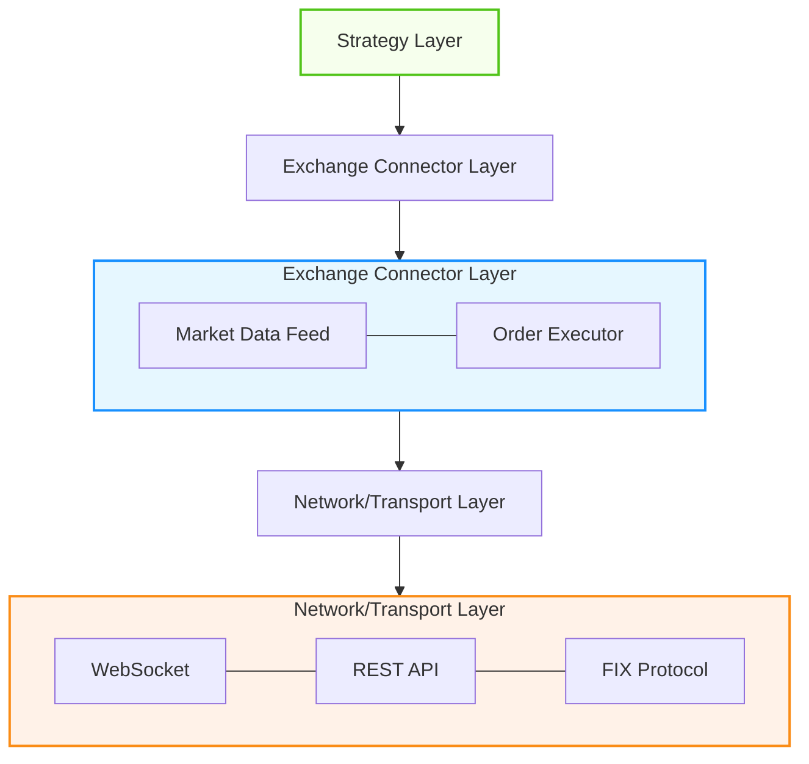
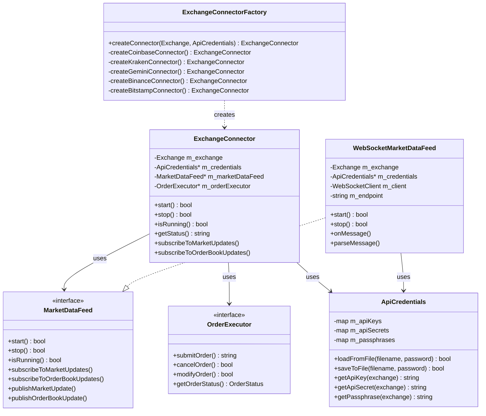
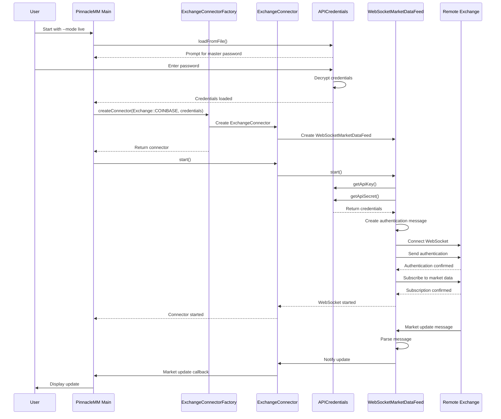

# Exchange Connector Implementation Guide

This guide provides detailed information about PinnacleMM's exchange connector system, including architecture, implementation details, and usage instructions.

## Overview

The exchange connector system allows PinnacleMM to connect to real cryptocurrency exchanges for market data and trading. It consists of modular components that handle:

1. **Market Data**: Real-time price feeds and order book updates
2. **Order Execution**: Placing, modifying, and canceling orders
3. **Authentication**: Securely connecting to exchange APIs
4. **Error Handling**: Robust handling of connectivity issues

## Architecture

The exchange connector system follows a layered design:



### Key Components

1. **ExchangeConnector**: The main interface for interacting with exchanges
2. **WebSocketMarketDataFeed**: Real-time market data via WebSockets
3. **ExchangeConnectorFactory**: Creates appropriate connector types
4. **SecureConfig**: Enhanced API credentials encryption with unique salt generation
5. **Security Infrastructure**: Comprehensive security utilities for enterprise protection

## Supported Exchanges

The connector system currently supports (or plans to support) these exchanges:

| Exchange   | Status      | Market Data | Order Execution |
|------------|-------------|-------------|-----------------|
| Coinbase   | Production | Live Ticker | Partial         |
| Kraken     | Planned     | Planned     | Planned         |
| Gemini     | Planned     | Planned     | Planned         |
| Binance    | Planned     | Planned     | Planned         |
| Bitstamp   | Planned     | Planned     | Planned         |

## Implementation

The following class diagram shows the relationships between the key components:



### ExchangeConnector

The `ExchangeConnector` class provides a unified interface for exchange operations:

```cpp
class ExchangeConnector {
public:
    // Constructor
    ExchangeConnector(
        Exchange exchange,
        std::shared_ptr<utils::ApiCredentials> credentials,
        std::shared_ptr<MarketDataFeed> marketDataFeed
    );
    
    // Core functionality
    bool start();
    bool stop();
    bool isRunning() const;
    std::string getStatus() const;
    
    // Market data subscription
    bool subscribeToMarketUpdates(
        const std::string& symbol,
        std::function<void(const MarketUpdate&)> callback
    );
    
    bool subscribeToOrderBookUpdates(
        const std::string& symbol,
        std::function<void(const OrderBookUpdate&)> callback
    );
    
    // Configuration
    void setRateLimits(int perSecond, int perMinute);
    void setRetryPolicy(int maxRetries, int retryDelayMs);
    
    // Accessors
    std::shared_ptr<MarketDataFeed> getMarketDataFeed() const;
    std::shared_ptr<OrderExecutor> getOrderExecutor() const;
    Exchange getExchangeType() const;
};
```

### WebSocketMarketDataFeed

The `WebSocketMarketDataFeed` class handles real-time market data:

```cpp
class WebSocketMarketDataFeed : public MarketDataFeed {
public:
    // Constructor
    WebSocketMarketDataFeed(
        Exchange exchange,
        std::shared_ptr<utils::ApiCredentials> credentials
    );
    
    // MarketDataFeed interface implementation
    bool start() override;
    bool stop() override;
    bool isRunning() const override;
    
    bool subscribeToMarketUpdates(
        const std::string& symbol,
        std::function<void(const MarketUpdate&)> callback
    ) override;
    
    bool subscribeToOrderBookUpdates(
        const std::string& symbol,
        std::function<void(const OrderBookUpdate&)> callback
    ) override;
    
    // Configuration
    void setConnectionParams(const std::string& endpoint, bool useSSL = true);
    void setAuthParams(const std::string& exchangeName);
    
    // Status
    std::string getStatusMessage() const;
};
```

### ExchangeConnectorFactory

The factory class creates the appropriate connector for each exchange:

```cpp
class ExchangeConnectorFactory {
public:
    static std::shared_ptr<ExchangeConnector> createConnector(
        Exchange exchange,
        std::shared_ptr<utils::ApiCredentials> credentials,
        const ConnectorConfig& config = ConnectorConfig()
    );
};
```

## WebSocket Implementation

The WebSocket implementation handles real-time data streams from exchanges with comprehensive security:

1. **Core Connection**: Uses Boost.Beast WebSocket with SSL/TLS for secure connections
2. **Certificate Pinning**: SSL certificate validation to prevent man-in-the-middle attacks
3. **Message Processing**: Processes JSON messages from exchanges with input validation
4. **Reconnection Logic**: Automatically reconnects on disconnection with security checks
5. **Rate Limiting**: Multi-strategy rate limiting (sliding window, token bucket) to prevent abuse
6. **Live Data Processing**: Successfully processes real-time market data from Coinbase Pro
7. **Audit Logging**: All network events logged for security monitoring

### Coinbase Pro WebSocket Implementation

The live Coinbase connector uses the following endpoint and message format:

```cpp
// Connection endpoint
const std::string COINBASE_WS_ENDPOINT = "wss://ws-feed.exchange.coinbase.com";

// Subscription message
{
    "type": "subscribe",
    "product_ids": ["BTC-USD"],
    "channels": ["ticker"]
}

// Example ticker message received:
{
    "type": "ticker",
    "sequence": 123456789,
    "product_id": "BTC-USD",
    "price": "109231.23",
    "open_24h": "108500.00",
    "volume_24h": "4554.12345678",
    "low_24h": "107800.00",
    "high_24h": "110000.00",
    "volume_30d": "125432.987654321",
    "best_bid": "109230.50",
    "best_ask": "109231.75",
    "side": "buy",
    "time": "2025-09-01T20:17:57.483000Z",
    "trade_id": 987654321,
    "last_size": "0.02345678"
}
```

### WebSocket Stub for Testing

For development and testing, we provide a stub implementation that simulates exchange connectivity:

```cpp
// WebSocketStub.h provides a mock implementation
namespace websocketpp_stub {
    // Mock WebSocket client interface
    template<typename T>
    class client {
        // Stub implementations
    };
}

// WebSocketMarketDataFeedStub.cpp uses the stub for testing
bool WebSocketMarketDataFeed::start() {
    std::cout << "Mock WebSocket connection started for " << getExchangeName() << std::endl;
    m_isRunning.store(true, std::memory_order_release);
    return true;
}
```

## Usage Examples

### Connecting to an Exchange

#### Connection Sequence

The following sequence diagram illustrates the exchange connection process:



```cpp
#include "exchange/connector/ExchangeConnectorFactory.h"
#include "exchange/connector/SecureConfig.h"

int main() {
    // Load credentials
    auto credentials = std::make_shared<pinnacle::utils::ApiCredentials>();
    credentials->loadFromFile("credentials.dat", "masterPassword");
    
    // Create connector configuration
    pinnacle::exchange::ConnectorConfig config;
    config.rateLimitPerSecond = 10;
    config.maxRetries = 3;
    
    // Create exchange connector
    auto connector = pinnacle::exchange::ExchangeConnectorFactory::createConnector(
        pinnacle::exchange::Exchange::COINBASE,
        credentials,
        config
    );
    
    // Start the connector
    if (connector->start()) {
        std::cout << "Connected to exchange" << std::endl;
    } else {
        std::cerr << "Failed to connect" << std::endl;
        return 1;
    }
    
    // Subscribe to market updates
    connector->subscribeToMarketUpdates("BTC-USD", [](const auto& update) {
        std::cout << "Price: " << update.price << ", Volume: " << update.volume << std::endl;
    });
    
    // Main loop
    while (true) {
        // Do something
        std::this_thread::sleep_for(std::chrono::milliseconds(100));
    }
    
    // Stop the connector
    connector->stop();
    
    return 0;
}
```

### Live Market Data Testing

To test with live market data from Coinbase:

1. **Setup credentials** (one-time):
   ```bash
   ./pinnaclemm --setup-credentials
   ```

2. **Run with live data**:
   ```bash
   ./pinnaclemm --mode live --exchange coinbase --symbol BTC-USD --verbose
   ```

3. **Example live output**:
   ```
   [2025-09-01 20:17:57.483] Connected to live exchange: coinbase
   [2025-09-01 20:17:57.484] Live BTC Price: $109,231.23, Volume: 0.02345678
   [2025-09-01 20:17:57.521] Live BTC Price: $109,229.75, Volume: 0.01234567
   ```

### Using the WebSocket Stub for Testing

For development without live connections:

1. Build with the `USE_WEBSOCKET_STUB` flag enabled:
   ```bash
   cmake .. -DUSE_WEBSOCKET_STUB=ON
   ```

2. The application will use simulation automatically:
   ```bash
   ./pinnaclemm --mode simulation --symbol BTC-USD
   ```

## Rate Limiting

The connector system implements exchange rate limiting to avoid being blocked:

```cpp
bool ExchangeConnector::checkRateLimit() {
    std::lock_guard<std::mutex> lock(m_rateLimitMutex);
    
    auto now = std::chrono::steady_clock::now();
    auto sinceLast = std::chrono::duration_cast<std::chrono::milliseconds>(
        now - m_lastRequestTime).count();
    
    // Reset counters if a second has passed
    if (sinceLast >= 1000) {
        m_requestsThisSecond = 0;
        m_lastRequestTime = now;
    }
    
    // Check rate limits
    if (m_requestsThisSecond >= m_rateLimitPerSecond) {
        return false;
    }
    
    // Increment counters
    m_requestsThisSecond++;
    m_requestsThisMinute++;
    
    return true;
}
```

## Error Handling and Retry Logic

The connector implements robust error handling and automatic retries:

```cpp
// Example of retry logic (simplified)
bool sendRequest(const std::string& request) {
    for (int attempt = 0; attempt <= m_maxRetries; attempt++) {
        try {
            // Attempt the request
            bool success = doSendRequest(request);
            if (success) {
                return true;
            }
        } catch (const std::exception& e) {
            // Log the error
            spdlog::error("Request failed (attempt {}/{}): {}", 
                attempt + 1, m_maxRetries + 1, e.what());
        }
        
        // Wait before retrying
        if (attempt < m_maxRetries) {
            utils::TimeUtils::sleepForMillis(m_retryDelayMs);
        }
    }
    
    return false;
}
```

## Security Architecture

The exchange connector system implements comprehensive security measures:

### Credential Security

- **Enhanced Encryption**: AES-256-CBC with unique salt generation + 100,000 PBKDF2 iterations
- **Secure Input**: Cross-platform password masking preventing credential exposure
- **Memory Safety**: Volatile memory clearing after use to prevent credential leakage
- **Access Control**: Master password authentication required for all credential operations

### Network Security

- **Certificate Pinning**: SSL certificate validation for all WebSocket connections
- **Input Validation**: Comprehensive validation of all incoming market data and messages
- **Rate Limiting**: Multi-strategy rate limiting to prevent API abuse and DoS attacks
- **Connection Monitoring**: Real-time monitoring of connection health and security events

### Audit and Monitoring

- **Security Event Logging**: All authentication, connection, and data events logged
- **Failed Access Monitoring**: Failed credential attempts and connection failures tracked
- **Real-time Alerts**: Security violations trigger immediate alerts
- **Compliance**: Structured logging for regulatory compliance and audit trails

### Threat Protection

- **Injection Prevention**: All JSON message parsing protected against injection attacks
- **Man-in-the-Middle Protection**: Certificate pinning prevents MITM attacks
- **Replay Attack Prevention**: Timestamp validation and nonce generation
- **Data Tampering Detection**: Message integrity validation using checksums

## Future Enhancements

Planned improvements to the exchange connector system:

1. **FIX Protocol Support**: Add support for FIX protocol connections with enhanced security
2. **Connection Pooling**: Manage multiple secure connections for high throughput
3. **Smart Order Routing**: Intelligently route orders across exchanges with security validation
4. **Cross-Exchange Arbitrage**: Leverage price differences between exchanges securely
5. **Performance Monitoring**: Detailed performance metrics and security monitoring
6. **Zero-Trust Architecture**: Complete zero-trust security model for all exchange interactions
7. **Hardware Security**: Integration with hardware security modules (HSMs) for key storage

## Troubleshooting

### Common Issues

1. **Connection Failures**
   - Check network connectivity
   - Verify API credentials with `./pinnaclemm --setup-credentials`
   - Ensure rate limits aren't exceeded
   - For Coinbase: Verify endpoint `wss://ws-feed.exchange.coinbase.com` is accessible

2. **Missing Market Data**
   - Verify subscription parameters ("ticker" channel is public, "level2" requires auth)
   - Check exchange status at status pages
   - Ensure the symbol format is correct for the exchange (e.g., "BTC-USD" for Coinbase)
   - Run with `--verbose` to see detailed WebSocket messages

3. **Authentication Issues**
   - Run `./pinnaclemm --setup-credentials` to reset credentials with secure input
   - Check master password is correct (secure input with terminal masking)
   - For Coinbase ticker data: No authentication required
   - For advanced features: Verify API key permissions include market data access
   - **"Key derivation failed"**: Config file may be corrupted; delete and recreate credentials

4. **Security Issues**
   - **Certificate validation errors**: Certificate pinning may be blocking connection; check audit logs
   - **Rate limit exceeded**: Wait for cooldown period or check rate limiting configuration
   - **Input validation failures**: Check audit logs for injection attempt details
   - **Authentication failures**: Check master password and credential integrity

5. **Live Data Issues**
   - **"Failed to load secure config"**: Run setup-credentials first with secure input
   - **Empty order book**: Normal for ticker-only data; full order book requires authentication
   - **WebSocket disconnections**: Automatic reconnection implemented with security checks, monitor audit logs