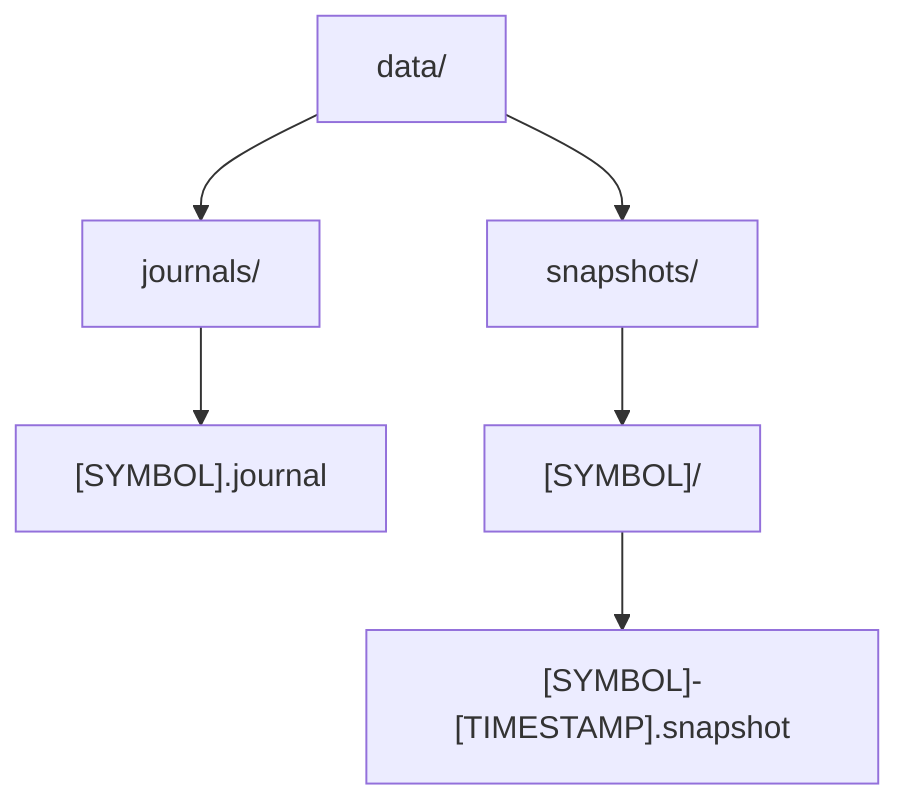

# Crash Recovery Guide

This guide explains how the PinnacleMM crash recovery system works and how to configure and troubleshoot it.

## How Recovery Works

PinnacleMM uses a combination of journaling and snapshots to provide crash recovery:

1. **Journaling**: Every order operation (add, cancel, execute) is recorded in a journal file
2. **Snapshots**: Periodic snapshots of the order book state are taken
3. **Recovery**: On startup, the system loads the latest snapshot and replays recent journal entries

This ensures that after a crash or unexpected shutdown, the system can recover to its previous state with minimal data loss.

## Directory Structure

The persistence system creates and uses the following directory structure:



## Configuration Options

The persistence system can be configured in the `default_config.json` file:

```json
{
  "persistence": {
    "enabled": true,
    "dataDirectory": "data",
    "journalSyncIntervalMs": 100,
    "snapshotIntervalMin": 15,
    "keepSnapshots": 5,
    "compactionThreshold": 1000000
  }
}
```

### Parameters

- `enabled`: Enables or disables the persistence system
- `dataDirectory`: Base directory for journals and snapshots
- `journalSyncIntervalMs`: How often to force journal synchronization (milliseconds)
- `snapshotIntervalMin`: How often to create snapshots (minutes)
- `keepSnapshots`: Number of snapshots to retain before deletion
- `compactionThreshold`: Journal size threshold for compaction (bytes)

## Monitoring Recovery

When the system starts up, it will output log messages indicating the recovery process:

```
[INFO] Initializing persistence for BTC-USD
[INFO] Loading latest snapshot from 1712345678900
[INFO] Replaying 42 journal entries
[INFO] Recovery completed successfully
```

You can check if recovery is working correctly by:

1. Running the system for a while to generate orders and trades
2. Force-quitting the application (e.g., with `kill -9`)
3. Restarting and verifying that the order book state is preserved

## Troubleshooting

### Journal Files Not Created

**Symptoms**: No journal files appear in the data directory.

**Solutions**:
- Check file system permissions
- Ensure the data directory is writable
- Verify that persistence is enabled in the configuration

### Recovery Fails

**Symptoms**: System reports errors during recovery or starts with an empty order book.

**Solutions**:
- Check for journal file corruption
- Verify that snapshots exist and are readable
- Check log files for specific error messages
- Ensure there is sufficient disk space

### Performance Issues

**Symptoms**: System becomes slow when journaling or creating snapshots.

**Solutions**:
- Increase the snapshot interval
- Move the data directory to a faster storage device
- Reduce journal sync frequency
- Consider using an SSD for improved performance

## Platform-Specific Notes

### macOS

The macOS implementation uses a different memory-mapping approach than Linux due to platform limitations:

- Uses a combination of `munmap`/`mmap` instead of `mremap` for file resizing
- May have slightly higher overhead during journal resizing operations

### Linux

On Linux systems, additional performance can be gained by:

- Using XFS or Ext4 file systems with appropriate mount options
- Configuring higher limits for memory-mapped regions
- Using direct I/O for snapshots if available

## Security Considerations for Recovery

The recovery system includes several security measures to protect sensitive data:

### Encrypted Credential Recovery

- **Secure Storage**: API credentials remain encrypted during recovery operations
- **Master Password**: Required to decrypt credentials after system restart
- **Salt Preservation**: Unique salts are preserved during backup and recovery
- **Memory Safety**: Temporary decryption keys are securely cleared after recovery

### Audit Trail Recovery

- **Security Events**: All security events are journaled and recovered after crashes
- **Authentication Logs**: Failed and successful authentication attempts are preserved
- **Access Logs**: API access patterns and rate limiting data are recovered

### Recovery Security Best Practices

1. **Secure Backups**: Encrypt backup files containing sensitive data
2. **Access Control**: Restrict file permissions on recovery directories (600/700)
3. **Monitor Recovery**: Log and monitor all recovery operations for security events
4. **Validate Integrity**: Verify checksums of recovered credential files

## Data Backup

Although the persistence system provides crash recovery, it is not a replacement for proper backups:

1. Regularly back up the entire data directory with encryption
2. Consider incremental backups of journal files
3. Securely backup encrypted credential files with salt preservation
4. Test recovery from backups periodically in secure environments

## Note on DPDK Integration

The original plan included DPDK integration for kernel bypass networking, which has been deferred because:

1. It requires specialized hardware support not available in typical development environments
2. It has limited support for macOS, which is used as a development platform
3. It involves system-level modifications best implemented in a dedicated environment

DPDK integration will be revisited when suitable hardware and environment are available.
